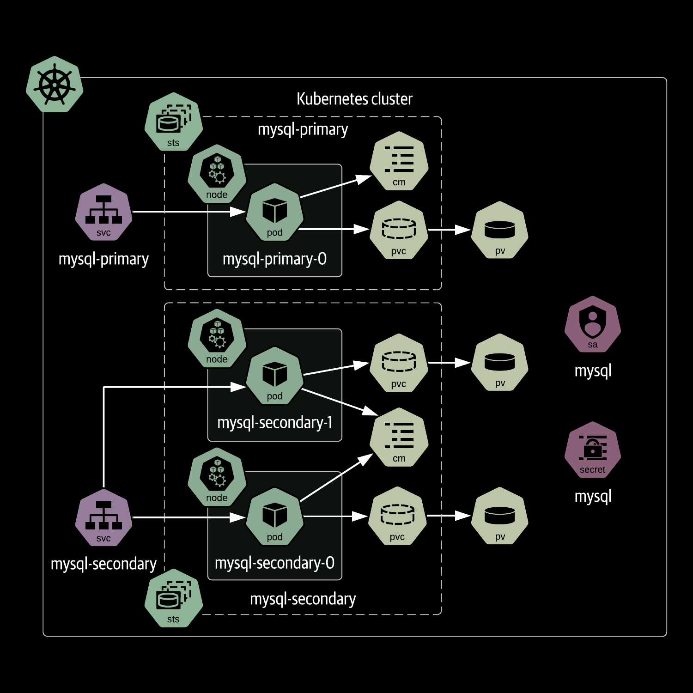

# Installer un Mysql répliqué via le chart de Bitnami

Nous pouvons utiliser ArgoCD pour installer le chart car cet operateur d'applications GitOps permet de plus facilement visualiser et analyser le résultat de l'installation (avant même d'appliquer le chart dans le cluster)

Allons voir le chart sur https://artifacthub.io: https://artifacthub.io/packages/helm/bitnami/mysql


Voir les paramètres possibles d'installation: https://artifacthub.io/packages/helm/bitnami/mysql?modal=values

Créons un fichier `mysql-values.yaml` et utilisons les valeurs suivantes:

```yaml
architecture: replication # default standalone
secondary:
  replicaCount: 2
auth:
  ## @param auth.rootPassword Password for the `root` user. Ignored if existing secret is provided
  ## ref: https://github.com/bitnami/containers/tree/main/bitnami/mysql#setting-the-root-password-on-first-run
  ##
  rootPassword: "oaU*iu3ku84ef"
  ## @param auth.createDatabase Whether to create the .Values.auth.database or not
  ## ref: https://github.com/bitnami/containers/tree/main/bitnami/mysql#creating-a-database-on-first-run
  ##
  createDatabase: true
  ## @param auth.database Name for a custom database to create
  ## ref: https://github.com/bitnami/containers/tree/main/bitnami/mysql#creating-a-database-on-first-run
  ##
  database: "app"
  ## @param auth.username Name for a custom user to create
  ## ref: https://github.com/bitnami/containers/tree/main/bitnami/mysql#creating-a-database-user-on-first-run
  ##
  username: "app"
  ## @param auth.password Password for the new user. Ignored if existing secret is provided
  ##
  password: "Uiku8u?oa34e-"
```

- Pour templater le manifest: `helm template mysql-chart bitnami/mysql --version=11.1.19 --values=mysql-values.yaml > mysql-chart-manifests.yaml`

- Appliquez le manifest `mysql-argocd-chart-ns.yaml`




## Initialiser une base de donnée avec un script pour plus de flexibilité

```yaml
initdbScripts:
  my_init_script.sh: |
    #!/bin/bash
    if [[ $(hostname) == *primary* ]]; then
      echo "Primary node"
      password_aux="${MYSQL_ROOT_PASSWORD:-}"
      if [[ -f "${MYSQL_ROOT_PASSWORD_FILE:-}" ]]; then
          password_aux=$(cat "$MYSQL_ROOT_PASSWORD_FILE")
      fi
      mysql -P 3306 -uroot -p"$password_aux" -e "create database new_database";
    else
      echo "Secondary node"
    fi
```

Le script ci-dessus s'assure qu'il n'est executé qu'une fois sur le replica `primary`